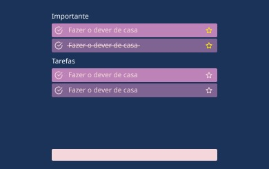
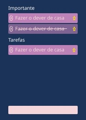

# Todo App

### Passos para testar em ambiente local

- Clonar o projeto
- No projeto foi usado uma versão específica do nodejs, essa versão está disponível no arquivo .nvmrc
  - Se possuir nvm na sua máquina, é necessário apenas rodar "nvm use"
- Após isso, pode rodar o comando "yarn install" para instalar os pacotes do package.json
- Agora podemos rodar o comando "yarn dev" para subir o projeto localmente
- Abrir o browser com a url: "http://localhost:5173/"

# Próximas etapas

- Tasks

  - Colocar mais atributos na tarefa
  - Data
  - Peso
  - Descrição
  - Subtasks

- Filtros

  - Colocar filtros por:
    - data
    - peso de imporância
    - nome

- Calendário para melhorar a visualização de tarefas de um dia em específico.
- Sincronização com algum banco de dados para compartilhar a informação em outrs dispositivos
- Login de autenticação para os usuários
- PWA, para melhorar a experiência mobile
- Navegação interna entre outras páginas
- Documentação de componentes com Storybook
- Testes autmatizados:
  - Jets para testes unitários
  - Cypress para testes E2E

# Mockup da aplicação

### WEB

### Mobile

